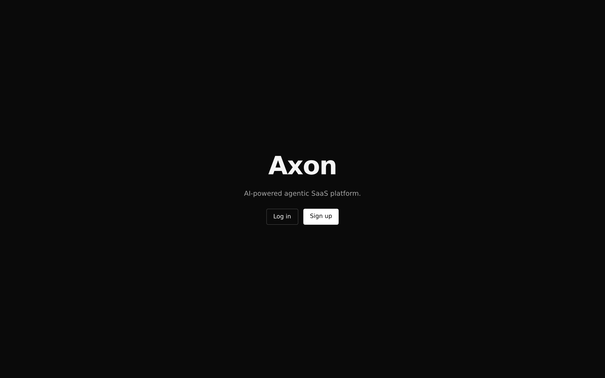
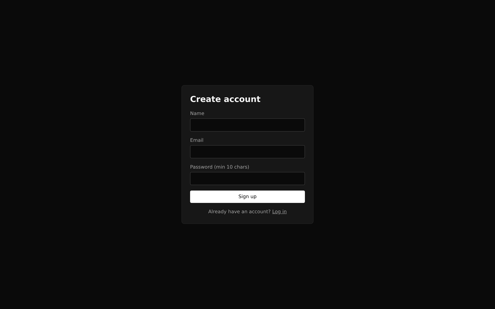
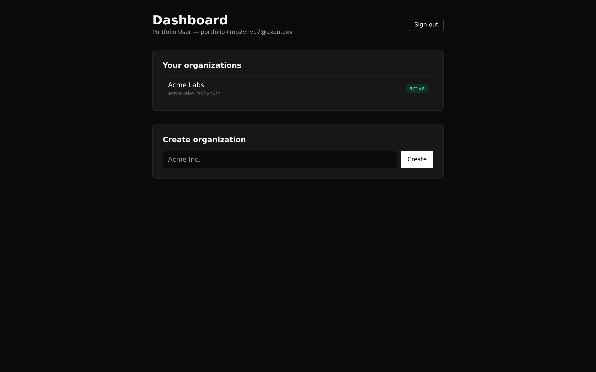
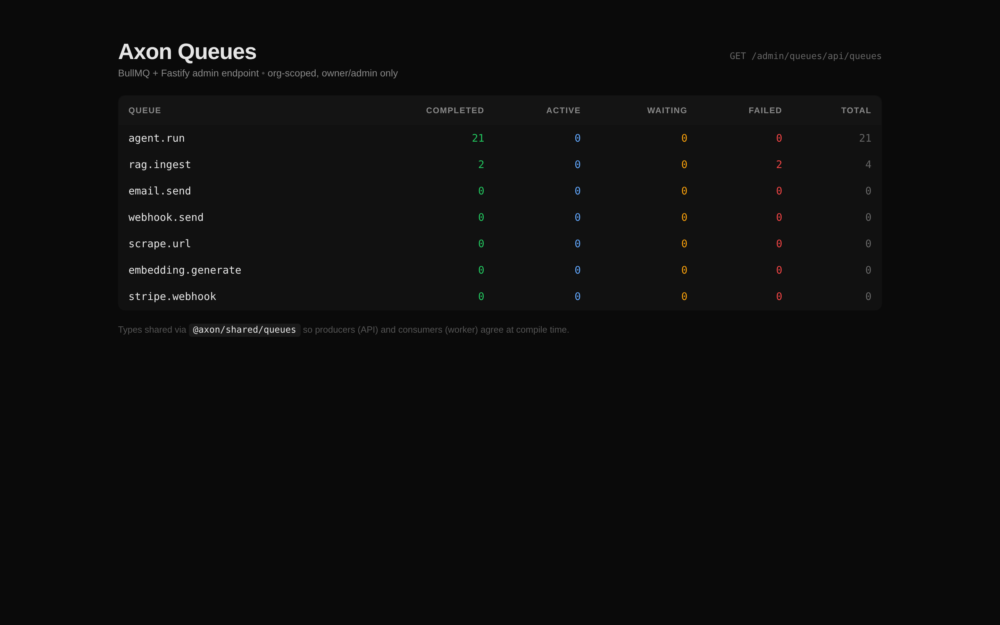
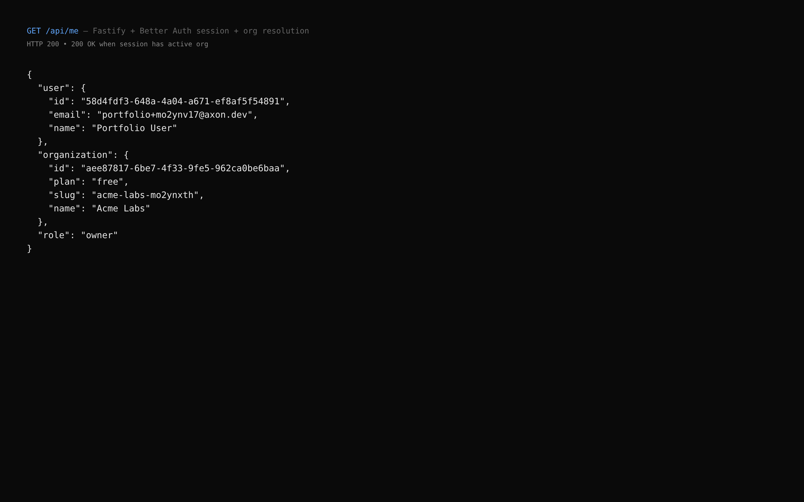
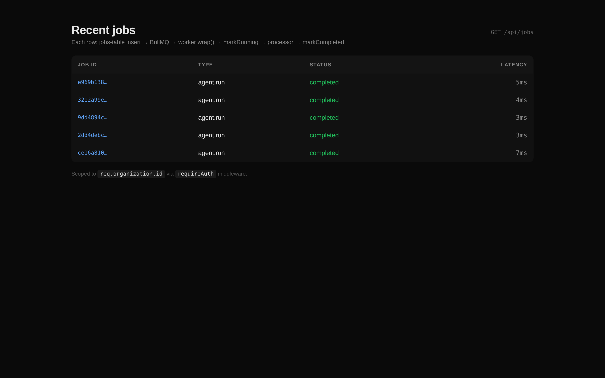

# Axon

> Production-grade AI agent SaaS, built in public. Multi-tenant, queue-first, MCP-native, $0 stack.

[](https://nodejs.org)
[](https://pnpm.io)
[](https://nextjs.org)
[](https://fastify.dev)
[](https://python.org)
[](https://postgresql.org)
[](LICENSE)

Axon is the reference codebase for a modern AI agent platform: agentic chat with tool calls, per-tenant RAG, queue-first async work, multi-LLM routing, MCP integrations, and full observability. Every layer ships as runnable code, not slides.

---

## What's inside

- **Agentic chat** (Phase 4): LangGraph agents with tool calling, streaming via SSE
- **Multi-tenant RAG** (Phase 5): document upload → chunk → embed → hybrid vector + FTS search, per-org isolation
- **Queue-first architecture**: every LLM call, scrape, email, embed job goes through BullMQ (Phase 3 live)
- **Row-level security**: Postgres RLS policies gate every tenant-scoped query at the DB (Phase 2 live, runtime-enforced)
- **Better Auth**: email/password + session cookies + org plugin, cross-service cookie verification (Phase 2 live)
- **Multi-LLM router** (Phase 4): Groq primary, Gemini fallback, OpenRouter/Claude/GPT/Ollama as needed
- **MCP servers** (Phase 6): Postgres, GitHub, Stripe — usable by Axon agents and external clients like Claude Desktop
- **Observability** (Phase 7): Langfuse for LLM traces, Prometheus + Grafana + Loki for infra
- **$0 deploy target** (Phase 8): Oracle Cloud Always Free ARM + Cloudflare Tunnel + Caddy auto-HTTPS

## Architecture

```
+------------------------------------------------------------------------+
|                        BROWSER / EXTERNAL CLIENTS                       |
+--+------------------------+-----------------------+---------------------+
   | app.axon.xyz           | api.axon.xyz          | MCP clients         |
   v                        v                       v                     |
+------------+   +-----------------+   +----------------------+           |
|  Next.js   |   |  Fastify API    |   |  MCP servers (stdio) |           |
|  (web)     |-->|  + Better Auth  |   |  postgres / github   |           |
|            |   |  + BullMQ       |   |  stripe / custom     |           |
+------------+   +--------+--------+   +----------------------+           |
                          |                                                |
                   enqueue|                                                |
                          v                                                |
              +----------------------+      +----------------------+       |
              |  BullMQ workers      |<---->|  Python agents svc  |       |
              |  (7 processors)      | HTTP |  LangGraph + tools  |       |
              +-----------+----------+      +----------+-----------+       |
                          |                            |                   |
                          v                            v                   |
         +-------------------------------------------------------+         |
         |   Postgres 16 + pgvector   |  Redis 7  |  MinIO (S3) |         |
         |   (RLS per-tenant)         |  queue+cache| storage   |         |
         +-------------------------------------------------------+         |
                          |                                                |
                          v                                                |
         +-------------------------------------------------------+         |
         |  Langfuse (LLM traces) | Grafana/Prometheus/Loki     |         |
         +-------------------------------------------------------+         |
                                                                           |
         Outbound: Groq | Gemini | OpenRouter | Stripe | Resend           |
+------------------------------------------------------------------------+
```

## Tech stack

| Layer | Tech |
|---|---|
| Monorepo | pnpm workspaces + Turborepo |
| Frontend | Next.js 15, React 19, Tailwind, shadcn/ui |
| API | Fastify 5, Zod, Better Auth |
| Agents | Python 3.12, LangGraph, FastAPI |
| Queue | BullMQ 5 + Redis 7 |
| Database | Postgres 16 + pgvector, Drizzle ORM 0.45 |
| Storage | MinIO (S3-compatible) or Cloudflare R2 |
| Auth | Better Auth (self-hosted) with organization plugin |
| LLMs | Groq (Llama 3.3), Gemini Flash, Claude, GPT, Ollama |
| Observability | Langfuse + Prometheus + Grafana + Loki |
| Deploy | Docker + Caddy + Cloudflare Tunnel + Oracle Cloud ARM |

## Case study: how a law firm uses Axon

*Representative deployment. Names are illustrative.*

### Profile

Sara Khan runs **Khan & Partners**, a 12-lawyer firm in Lahore specialising in commercial litigation. The firm has roughly 40,000 pages of case files, contracts, and judgments across the last eight years. She wants an AI assistant that can answer questions like *"What was the final ruling in the Akhtar v. Habib case?"* and *"Find the force-majeure clauses we drafted in 2023 shipping contracts."* She does not want her data sent to OpenAI or stored on third-party servers.

A developer deploys Axon for her. The rest of this walkthrough follows what happens end to end.

### Step 1. Sara creates her workspace

Sara opens `https://app.khan-partners.ai` in her browser.

- **Signup**: Better Auth creates a `users` row, hashes her password, and issues a session cookie that's valid for 30 days. She also creates an organisation called *Khan & Partners*. A `members` row links her user to the org with `role = owner`. `sessions.active_organization_id` now points to that org.
- **Invite colleagues**: she invites two paralegals via `/api/auth/organization/invite`. They sign in via emailed invite links and land in the same org with `role = member`.

All three users now share the same org. Every piece of data they ever create will have `organization_id` stamped on it and be fenced by Postgres Row-Level Security.

### Step 2. Uploading case files

A paralegal drags a 2.4 MB PDF of *Akhtar v. Habib (final judgment)* into the web upload pane.

1. **Web → API**: Next.js `POST /api/documents` with the file. The API streams the bytes into MinIO (S3-compatible), creates a row in the `documents` table via a `withOrg(orgId, tx => ...)` transaction (so RLS sets the tenant GUC), and **returns immediately**. The user sees a toast within 200 ms. The heavy work happens elsewhere.
2. **API → BullMQ**: the API enqueues a `rag.ingest` job carrying `{ documentId, source, sourceType, _meta: { orgId, jobId } }`. The job ID is also recorded in the `jobs` table so the user can track status.
3. **Worker picks up the job**: a BullMQ worker extracts raw text from the PDF, splits it into chunks of roughly 500 tokens with 50-token overlap, and generates 768-dimensional vector embeddings for each chunk using a local Ollama model (`nomic-embed-text`). No data leaves the server.
4. **Postgres stores the chunks**: each chunk row gets `(document_id, organization_id, content, embedding, token_count)`. The `embedding` column is a pgvector `vector(768)` with an HNSW index using cosine distance. A GIN full-text-search index is built on `content` in parallel.
5. **Worker updates the job**: `jobs.status → completed`. Total elapsed for a 50-page PDF: ~18 seconds on a single Oracle ARM core.

### Step 3. Sara asks a question

Sara types *"Summarise the force-majeure clauses we drafted in 2023 shipping contracts, and cite the documents."* and hits enter.

1. **Web → API**: `POST /api/chat` streams a single HTTP request to the Fastify API with her session cookie.
2. **API → Python agents service**: the API upserts a `conversations` row, persists the user message, then proxies the request as SSE to the Python agents service. The API never calls the LLM directly — that's the agents service's job.
3. **LangGraph starts an agent run**: the default agent is a state machine with three nodes.
   - `llm` receives the system prompt plus the user message.
   - `tools` executes any tool the LLM decides to call.
   - Edges loop `llm → tools → llm` until the LLM returns a final answer.
4. **The agent decides to use RAG**: Llama 3.3 on Groq emits a tool call `rag_search({query: "force majeure 2023 shipping contracts"})`.
5. **The RAG tool runs inside Sara's org**: the tool opens a transaction that sets `app.current_org_id = <Khan & Partners org id>`. It runs a hybrid SQL query that combines pgvector cosine similarity (weighted 70%) and Postgres FTS `ts_rank` (30%) on `chunks`. RLS guarantees the tool cannot see any other tenant's rows, even if the agent tries to manipulate `organization_id` directly.
6. **Top 10 chunks come back**: the agent receives titles, excerpts, and similarity scores. It calls Groq again with the retrieved context.
7. **Stream tokens to Sara**: the Python service emits `{type: "token", content: "..."}` SSE frames. Fastify proxies them to Next.js, which appends each token to the assistant bubble in real time. Sara sees the answer type itself out.
8. **Persist the exchange**: when the stream ends, the API writes the complete assistant message to `messages` under the same conversation ID and the same org.
9. **Observe the run**: Langfuse records the full trace — prompt, completion, tool calls, token counts, latency per node, and cost. Filtered per org, so the firm can see exactly what each user is asking.

Total elapsed from hitting enter to the last token: roughly 2.5 seconds for a 400-token answer with one RAG lookup.

### Step 4. Safety properties that hold automatically

- Sara's paralegal cannot accidentally read another firm's case files. RLS rejects the query before a single byte leaves Postgres.
- If the developer writing a new feature forgets a `where organization_id = ?` clause, the database still returns zero cross-tenant rows.
- If Groq rate-limits, the LLM router falls back to Gemini automatically via a `tenacity` retry chain. Sara never sees a 500.
- If the agent takes 30 seconds, the API doesn't block. The chat uses SSE for streaming and the queue for any genuinely long-running work, so the Fastify event loop is never pinned.
- If the Oracle VM reboots, BullMQ resumes in-flight jobs from Redis and Postgres is restored from the last backup to Cloudflare R2. No data loss.

### Step 5. Cost

| Component | Traditional SaaS | Axon |
|---|---|---|
| VM | $40–100/mo | **Oracle Cloud Always Free ARM (4 cores, 24 GB)** |
| Reverse proxy + HTTPS | $10–20/mo | **Caddy** (free, auto-HTTPS) |
| LLM inference (moderate usage) | $50–500/mo | **Groq + Gemini free tiers** |
| Vector DB | $70+/mo (Pinecone) | **Postgres + pgvector** (already running) |
| Observability | $50+/mo (Datadog) | **Langfuse + Grafana/Loki/Prom self-hosted** |
| Object storage | $5–30/mo | **MinIO self-hosted** or **Cloudflare R2 free tier** |
| **Total** | **$225–780/mo** | **~$0.17/mo** (a `.xyz` domain) |

Sara's firm pays nothing ongoing for the platform itself. Their only cost is the developer's deployment fee and a domain.

## Build phases

| Phase | Milestone | Status |
|---|---|---|
| 1 | Monorepo + Docker data layer + 4 app shells | ✅ shipped |
| 2 | Drizzle schema + Better Auth + multi-tenant + **RLS enforced at runtime** | ✅ shipped |
| 3 | BullMQ queue system + workers + Bull Board | ✅ shipped |
| 4 | Python agents + LangGraph + multi-LLM router + SSE chat | ✅ shipped |
| 5 | RAG pipeline: upload → chunk → embed → hybrid search | ✅ shipped |
| 6 | MCP servers (postgres, custom template) | ✅ shipped |
| 7 | Observability (Langfuse + Prometheus + Grafana + Loki + Alertmanager → ntfy) | ✅ shipped |
| 8 | Billing + CI/CD + prod deploy scaffolding | ✅ code-complete (deploy blocked on external creds) |
| 9 | Mobile companion app (Expo Android + iOS) | ✅ shipped |
| — | Agent marketplace, fine-tune loop, prompt-injection fence, webhook idempotency | ✅ shipped |

Each phase produces something runnable. See [CLAUDE.md](CLAUDE.md) for the full task breakdown.

## What's live in the codebase

Everything above. A second-pass completion sweep closed the remaining open items:

- **Mobile app** (`apps/mobile/`): Expo SDK 52 + React Native 0.76 + Expo Router + NativeWind. Screens: login, chat (SSE streaming + offline queue + voice input via Groq Whisper + template picker), documents (upload + chunk-count polling). Push notifications for long-running agent runs. EAS build profiles + store-submission playbook in `apps/mobile/RELEASE.md`.
- **Agent marketplace** (`/agents` on web, picker on mobile): org-owned templates with system prompt + allowed tool list + allowed LLM provider list. Optional public flag makes them discoverable in a marketplace feed; fork copies the template into another org's workspace. The agent service resolves the template per run and filters tools + LLM router accordingly.
- **Fine-tune loop**: thumbs-up/down on every assistant message, `POST /api/chat/messages/:id/feedback`. `GET /api/chat/feedback/export` returns NDJSON of `{prompt, completion, rating, reason}` tuples ready for LoRA / few-shot use.
- **Prompt-injection fence**: RAG chunks wrapped in `<untrusted_excerpt>` delimiters with an instruction telling the LLM to treat enclosed text as data, not directives. Fence strings neutralised to prevent an attacker-uploaded document from closing the fence early.
- **Webhook idempotency**: Stripe webhooks deduped in Redis via `SET NX EX 24h` on `event.id`, so dashboard replays and Stripe retries don't double-process.
- **ntfy alerting**: Alertmanager wired to Prometheus; drop an ntfy topic into `NTFY_URL` and get alerts on your phone.

Still open (all external-cred-gated; code is ready):
- Real production deploy on Oracle Cloud + Cloudflare (see [project_phase_8_deploy_prereqs.md](~/.claude/projects/-home-atif-projects-axon/memory/project_phase_8_deploy_prereqs.md) in memory)
- Real App Store + Play Store submission (see [apps/mobile/RELEASE.md](apps/mobile/RELEASE.md))
- BGE / Qwen embedding model swap (Ollama nomic-embed-text is the current default)

## Screenshots

| Landing | Signup | Dashboard (orgs) |
|---|---|---|
|  |  |  |

| Queues overview | API /api/me | Recent jobs |
|---|---|---|
|  |  |  |

## What makes this different

**Tenant isolation that actually holds.** Most SaaS tutorials stop at "filter by org_id in every query." Axon enforces it at the database with Postgres RLS: the API connects as a non-superuser role, every tenant-scoped query runs inside a transaction that sets `app.current_org_id` via `set_config(..., true)`, and policies block reads + writes that don't match. Dropping the `where` clause in application code still leaks zero rows.

**Queue-first, not queue-maybe.** Every slow or failable op is a BullMQ job from day one. The API never calls an LLM inline, never sends an email inline, never scrapes inline. This is the architecture that doesn't fall over in production.

**Typed across the workspace.** Shared queue-name constants + per-queue job types live in `@axon/shared/queues`. The API's `enqueue()`, the worker's processors, and the job polling endpoint all agree at compile time.

**Cost discipline.** The whole production stack runs on free tiers: Oracle Cloud Always Free ARM VM, Cloudflare Tunnel, Groq + Gemini free tiers, Resend 3k/mo, MinIO self-hosted. ~$2/yr for a `.xyz` domain is the only recurring cost.

## License

MIT. See [LICENSE](LICENSE).
